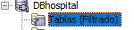

# PR1 - Oracle -- Victor Martinez
### ASGBD 


---
### Paso 1

Instala el SGBD Oracle y su herramienta Developer:


### Paso 2

**Crea dos tablespace: ts_dietaganadera y ts_hospital:**

Para **dieta_ganadera**:
```sql
 CREATE TABLESPACE ts_dbdietaganadera
    DATAFILE 'C:\app\viktor\product\21c\ts_dietaganadera.dbf'
    size 1 M
    AUTOEXTEND ON NEXT 10 M;
```


Para **db_hospital**:
```sql
 CREATE TABLESPACE ts_hospital
    DATAFILE 'C:\app\viktor\product\21c\ts_hospital.dbf'
    size 1 M
    AUTOEXTEND ON NEXT 10 M;
```


**Crea las tablas correpondientes a cada base de datos que trabajamos el curso pasado en MariaDB. Haz que el nombre de las tablas empieze por: 'T_' y aplica el filtro para que se vean las tablas que has creado:**

Para **dieta_ganadera**:
Creando las tablas:

```sql
CREATE TABLE T_ALIMENTO (

	NOMBRE_ALIMENTO VARCHAR2(20 BYTE), 
	TIPO_ALIMENTO VARCHAR2(20 BYTE), 
	COSTE NUMBER(6,2), 
	OD_ALIMENTO VARCHAR2(40 BYTE), 
	CALORIAS NUMBER(6,2),
) 
TABLESPACE ts_dietaganadera;
```

```sql
CREATE TABLE T_ANIMAL (

	COD_ANIMAL NUMBER, 
	TIPO_ANIMAL VARCHAR2(20 BYTE), 
	PESO NUMBER, 
	F_NACIMIENTO DATE, 
	UTILIDAD_ANIMAL VARCHAR2(20 BYTE), 
	PRODUCCION_ANIMAL VARCHAR2(20 BYTE), 
	OD_ANIMAL VARCHAR2(40 BYTE),
)
TABLESPACE ts_dietaganadera;
```

```sql
CREATE TABLE T_TOMA (

	COD_TOMA NUMBER, 
	NOMBRE_TOMA VARCHAR2(30 BYTE), 
	HORA_INICIO NUMBER, 
	HORA_FIN NUMBER, 
	OD_TOMA VARCHAR2(40 BYTE),
)
TABLESPACE ts_dietaganadera;
```

```sql
CREATE TABLE T_DIETA (

	COD_DIETA NUMBER, 
	FINALIDAD VARCHAR2(20 BYTE), 
	OD_DIETA VARCHAR2(40 BYTE),
)
TABLESPACE ts_dietaganadera;
```

```sql
CREATE TABLE T_NUTRIENTE (

	NOMBRE_NUTRIENTE VARCHAR2(30 BYTE), 
	MAGNITUD_NUTRIENTE VARCHAR2(20 BYTE), 
	ESTADO VARCHAR2(20 BYTE), 
	OD_NUTRIENTE VARCHAR2(40 BYTE),
)
TABLESPACE ts_dietaganadera;
```

```sql
CREATE TABLE T_ANIMAL_NUTRIENTE (

	COD_ANIMAL NUMBER,
	NOMBRE_NUTRIENTE VARCHAR2(30 BYTE),
	CANTIDAD_NECESARIA NUMBER,

)
TABLESPACE ts_dietaganadera;
```

```sql
CREATE TABLE T_DIETA_ANIMAL_FECHA_INICIO (

	COD_ANIMAL NUMBER,
	FECHA_INICIO DATE,
	COD_DIETA NUMBER,
	OD_RESULTADO VARCHAR2(40 BYTE),
)
TABLESPACE ts_dietaganadera;
```

```sql
CREATE TABLE T_NUTRIENTE_ALIMENTO (

	NOMBRE_NUTRIENTE VARCHAR2(30 BYTE),
	NOMBRE_ALIMENTO VARCHAR2(20 BYTE),
	CANTIDAD_CONTENIDA NUMBER,

)
TABLESPACE ts_dietaganadera;
```

```sql
CREATE TABLE T_ALIMENTO_DIETA_TOMA (	

	COD_DIETA NUMBER,
	NOMBRE_ALIMENTO VARCHAR2(20 BYTE),
	COD_TOMA NUMBER,
	CANTIDAD_TOMA NUMBER,

)
TABLESPACE ts_dietaganadera;
```

Para **db_hospital**:
Creando las tablas:

```sql
CREATE TABLE T_consulta (
  ID_CONSULTA VARCHAR2(45) NOT NULL,
  ID_DOCTOR NUMBER(3) NOT NULL,
  ID_PACIENTE NUMBER(5) NOT NULL,
  FECHA_CONSULTA DATE NOT NULL,
) 
TABLESPACE ts_hospital;
```

```sql
CREATE TABLE CP_POBLACION (
  CODIGO_POSTAL VARCHAR2(5) NOT NULL,
  POBLACION VARCHAR2(50) NOT NULL,

) 
TABLESPACE ts_dbhospital;
```

```sql
CREATE TABLE DIAGNOSTICO (
  ID_DIAGNOSTICO NUMBER(5) NOT NULL,
  DESCRIPCION VARCHAR2(200) NOT NULL,
  CONSULTA_ID VARCHAR2(45) NOT NULL,

) 
TABLESPACE ts_dbhospital;
```

```sql
CREATE TABLE DOCTOR (
  ID_DOCTOR NUMBER(3) NOT NULL,
  NOMBRE VARCHAR2(50) NOT NULL,
  APELLIDO1 VARCHAR2(50) NOT NULL,
  APELLIDO2 VARCHAR2(50) DEFAULT NULL,
  GENERO VARCHAR2(8) NOT NULL,
  ESPECIALIDAD VARCHAR2(150) NOT NULL,

) 
TABLESPACE ts_dbhospital;
```

```sql
CREATE TABLE MEDICAMENTO (
  ID_MEDICAMENTO NUMBER(5) NOT NULL,
  NOMBRE VARCHAR2(100) NOT NULL,
) 
TABLESPACE ts_dbhospital;
```

```sql
CREATE TABLE MEDICAMENTO_SINTOMA (
  ID_SINTOMA NUMBER(5) NOT NULL,
  ID_MEDICAMENTO NUMBER(5) NOT NULL,
  DOSIS_DIARIA NUMBER NOT NULL,

) 
TABLESPACE ts_dbhospital;
```

```sql
CREATE TABLE PACIENTE (
  ID_PACIENTE NUMBER(5) NOT NULL,
  NOMBRE VARCHAR2(50) NOT NULL,
  APELLIDO1 VARCHAR2(50) NOT NULL,
  APELLIDO2 VARCHAR2(50) DEFAULT NULL,
  GENERO VARCHAR2(8) NOT NULL,
  F_NACIMIENTO DATE NOT NULL,
  COD_VIA NUMBER(5) NOT NULL,
  COD_POST VARCHAR2(5) NOT NULL,
  TELF_CONTACTO VARCHAR2(15) NOT NULL,
) 
TABLESPACE ts_dbhospital;
```

```sql
CREATE TABLE PACIENTE_MEDICAMENTO_TRATAMIENTO (
  ID_PACIENTE NUMBER(5) NOT NULL,
  ID_MEDICAMENTO NUMBER(5) NOT NULL,
  DOSIS_DIARIA NUMBER NOT NULL,

) 
TABLESPACE ts_dbhospital;
```

```sql
CREATE TABLE SINTOMA (
  ID_SINTOMA NUMBER(5) NOT NULL,
  DESCRIPCION VARCHAR2(200) NOT NULL,
  ID_DIAGNOSTICO NUMBER(5) NOT NULL
) 
TABLESPACE ts_dbhospital;
```

```sql
CREATE TABLE VIA (
  COD_VIA NUMBER(5) NOT NULL,
  TIPO_VIA VARCHAR2(30) NOT NULL,
  NOM_VIA VARCHAR2(100) NOT NULL,
  NUMERO NUMBER(4) NOT NULL,
  PUERTA VARCHAR2(4) NOT NULL,
  ESCALERA VARCHAR2(10) DEFAULT NULL,
  PORTAL VARCHAR2(10) DEFAULT NULL,
  PISO VARCHAR2(10) DEFAULT NULL
) 
TABLESPACE ts_dbhospital;
```
---

### Creando los indices:

Indices de la tabla consulta
--
```sql
ALTER TABLE consulta

	ADD CONSTRAINT Pk_consulta PRIMARY KEY (id_consulta);
	CREATE INDEX Fk_consulta_doctor ON consulta (id_doctor);
	CREATE INDEX Fk_consulta_paciente ON consulta (id_paciente);
```

Indices de la tabla cp_poblacion
--
```sql
ALTER TABLE cp_poblacion

  ADD CONSTRAINT Pk_cp_poblacion PRIMARY KEY (codigo_postal,poblacion);
```

Indices de la tabla diagnostico
--
```sql
ALTER TABLE diagnostico

  ADD CONSTRAINT Pk_diagnostico PRIMARY KEY (id_diagnostico);
  CREATE INDEX Fk_diagnostico_consulta ON diagnostico (consulta_id);
```

Indices de la tabla doctor
--
```sql
ALTER TABLE doctor

  ADD CONSTRAINT Pk_doctor PRIMARY KEY (id_doctor);
  CREATE UNIQUE INDEX Uk_doctor_nom ON doctor (nombre,apellido1,apellido2);
```

Indices de la tabla medicamento
--
```sql
ALTER TABLE medicamento

  ADD CONSTRAINT Pk_medicamento PRIMARY KEY (id_medicamento);
```

Indices de la tabla medicamento_sintoma
--
```sql
ALTER TABLE medicamento_sintoma

  ADD CONSTRAINT Pk_medicamento_sintoma PRIMARY KEY(id_sintoma,id_medicamento);
  CREATE INDEX Fk_medicsint_medicamento ON medicamento_sintoma (id_medicamento);
```

Indices de la tabla paciente
--
```sql
ALTER TABLE paciente

  ADD CONSTRAINT Pk_paciente PRIMARY KEY (id_paciente);
  CREATE UNIQUE INDEX Uk_paciente_nom ON paciente (nombre,apellido1,apellido2);
  CREATE INDEX Fk_paciente_via ON paciente (cod_via);
  CREATE INDEX Fk_paciente_cp_poblacion ON paciente (cod_post);
```

Indices de la tabla paciente_medicamento_tratamiento
--
```sql
ALTER TABLE paciente_medicamento_tratamiento

  ADD CONSTRAINT Pk_paciente_medicamento_tratamiento PRIMARY KEY (id_paciente,id_medicamento);
  CREATE INDEX Fk_pacmedtrat_medicamento ON paciente_medicamento_tratamiento (id_medicamento);
```

Indices de la tabla sintoma
--
```sql
ALTER TABLE sintoma

  ADD CONSTRAINT Pk_sintoma PRIMARY KEY (id_sintoma);
  CREATE INDEX Fk_sintoma_diagnostico ON sintoma (id_diagnostico);
```

Indices de la tabla via
--
```sql
ALTER TABLE via

  ADD CONSTRAINT Pk_via PRIMARY KEY (cod_via);
```

---

### Creando las Restricciones:

Filtros para la tabla consulta
--
```sql
ALTER TABLE consulta

  ADD CONSTRAINT Fk_consulta_doctor FOREIGN KEY (id_doctor) REFERENCES doctor (id_doctor);
  ADD CONSTRAINT Fk_consulta_paciente FOREIGN KEY (id_paciente) REFERENCES paciente (id_paciente);
```

Filtros para la tabla diagnostico
--
```sql
ALTER TABLE diagnostico

  ADD CONSTRAINT Fk_diagnostico_consulta FOREIGN KEY (consulta_id) REFERENCES consulta (id_consulta);
```

Filtros para la tabla medicamento_sintoma
--
```sql
ALTER TABLE medicamento_sintoma

  ADD CONSTRAINT Fk_medicsint_medicamento FOREIGN KEY (id_medicamento) REFERENCES medicamento (id_medicamento);
  ADD CONSTRAINT Fk_medicsint_sintoma FOREIGN KEY (id_sintoma) REFERENCES sintoma (id_sintoma);
```

Filtros para la tabla paciente
--
```sql
ALTER TABLE paciente

  ADD CONSTRAINT Fk_paciente_cp_poblacion FOREIGN KEY (cod_post) REFERENCES cp_poblacion (codigo_postal);
  ADD CONSTRAINT Fk_paciente_via FOREIGN KEY (cod_via) REFERENCES via (cod_via);
```

Filtros para la tabla paciente_medicamento_tratamiento
--
```sql
ALTER TABLE paciente_medicamento_tratamiento

  ADD CONSTRAINT Fk_pacmedtrat_medicamento FOREIGN KEY (id_medicamento) REFERENCES medicamento (id_medicamento);

  ADD CONSTRAINT Fk_pacmedtrat_paciente FOREIGN KEY (id_paciente) REFERENCES paciente (id_paciente);
```

Filtros para la tabla sintoma
--
```sql
ALTER TABLE sintoma

  ADD CONSTRAINT Fk_sintoma_diagnostico FOREIGN KEY (id_diagnostico) REFERENCES diagnostico (id_diagnostico);

```
---

### Paso 3
Las tablas que puede ver **SYS** son las siguientes:


---
### Paso 4
Crea un usuario admin_dieta en el tablespace ts_dietaganadera y otro admin_hospital para
el tablespace ts_hospital. Crea una conexión para cada uno de ellos y muestra qué tablas
pueden ver.

```sql
CREATE USER admin_hospital identified by "1234" DEFAULT TABLESPACE ts_hospital;
GRANT CREATE TABLE to admin_hospital;
GRANT dba, connect, resource TO admin_hospital;
GRANT CREATE ANY VIEW TO admin_hospital WITH ADMIN OPTION;
```
Las tablas que puede ver este usuario son las siguientes:



Actualmente el usuario no puede ver ninguna ya que las tablas han sido creadas con sys

He de aclarar que la creacion del usuario solo se ha hecho con la base de datos de hospital ya que el procedimiento es el mismo con uno que con otro. 

---

### Paso 5
Investiga los informes que genera Oracle de forma automática e interprétalos. Explica dónde
se encuentran, cómo se llaman y qué contienen:

Son registros y archivos de Oracle que proporcionan información clave de la base de datos:

- Registro de Alerta (alert.log) - Contiene eventos críticos y se encuentra en la carpeta de registro de la base de datos.

- Archivos de Registro de Redo (Redo Logs) - Registros de cambios de datos y se encuentran en la carpeta de datos.
- Archivos de Registro de Rendimiento (Trace Files) - Contienen detalles de sesiones y se pueden configurar para ubicaciones específicas.
- Historia de Ejecución de Sentencias (SQL History) - Muestra historial de ejecución y está en vistas del diccionario de datos.
- Informe de Acceso a Objetos (Object Access Report) - Registra el acceso a objetos y se genera en la base de datos.
- Historial de Sesiones y Transacciones - Ofrece información de sesiones y se accede a través de vistas del diccionario de datos.
- Informe de Optimizador (Optimizer Report) - Proporciona detalles sobre la optimización de consultas y se genera como resultado de consultas SQL específicas.

---
### Paso 6
Crea archivos con spool, realizando diferentes pruebas con las opciones del comando.
Muestra parte de su contenido y explica cómo funciona el comando.

El comando spool puede servir para dirigir la salida de los resultados de las consultas y comandos SQL a un archivo de registro en lugar de mostrarlos en la pantalla.

```sql

SPOOL nombre_del_archivo
-- Ejemplos de Comandos sql y consultas
SPOOL OFF
```