# Trabajo empezando con docker
## Victor Martinez

### Paso 1

Lo primero que vamos a necesitar hacer es instalar docker y poder usarlo sin requerir de usar permisos de administrador, para ello ejecutaremos los siguientes comandos:

```bash
sudo apt install docker 
sudo usermod -aG docker $USER
```
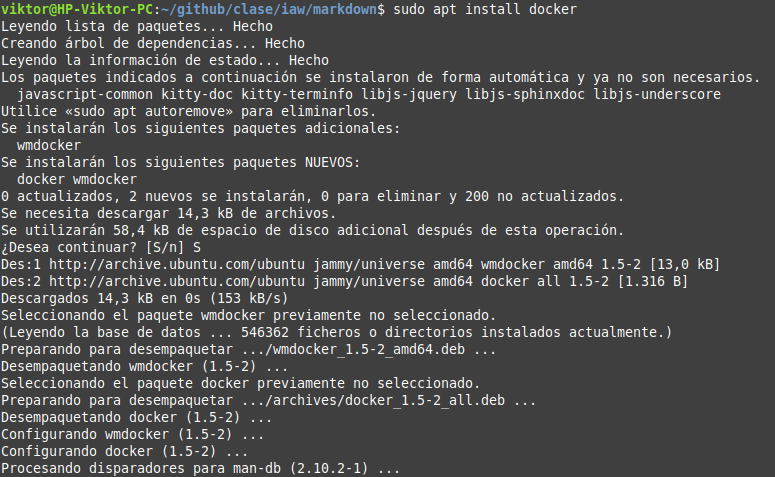
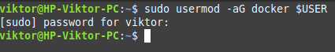

---
### Paso 2

ahora para comprobar que docker funcionan correctamente vamos a descargarnos un docker de hello-world y vamos a ver que pasa, para ello haremos los siguientes pasos:

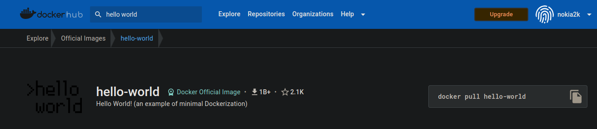
```bash
docker pull hello-world
docker run hello-world
```
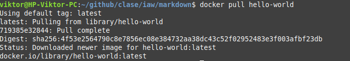

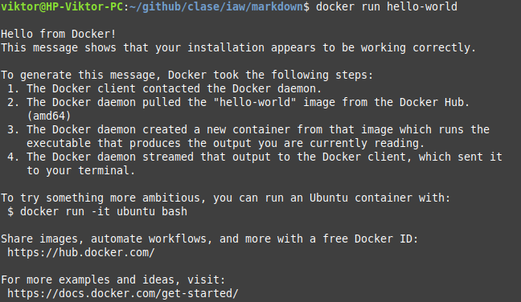

Este tipo de contenedor una vez mostrado el hello-world se apagara automaticamente, podemos observarlo con el comando **docker ps**:

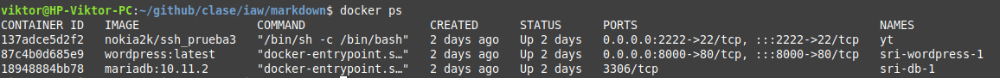

Como podemos ver en la imagen el contenedor de hello-world no esta activo, no como otros.

Si queremos ver los contenedores que estan parados lo unico que tendriamos que hacer es escribir el parametro **-a**:

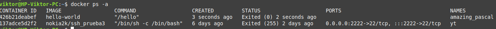

Aqui podemos observar que solo tenemos dos contenedores y estan los dos parados

Para borrarlo simplemente tendriamos que ejecutar el siguiente comando:

```bash
docker rm ID_DEL_DOCKER
```
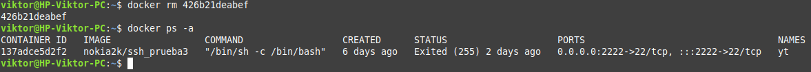

### Paso 3

Ahora vamos a crear un contenedor de ubuntu y vamos a instalar el paquete nano, para ello ejecutaremos esta serie de comandos:

```bash
docker pull ubuntu
docker run -it ubuntu
apt update
apt install nano
nano ejemplo.txt
```

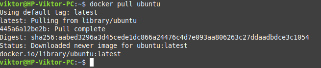

aqui vemos que se ha descargado correctamente la imagen del docker

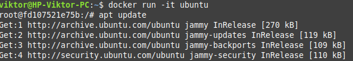

Hacemos esto para que a la hora de bajarnos el nano no nos de ningun tipo de conflicto por paqutes antiguos

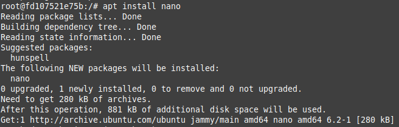

Instalamos el nano como en una maquina normal

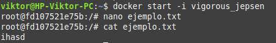

Si salimos y volvemos a entrar y usamos el docker podemos observar que si que sigue instalado el docker y se puede usar tranquilamente

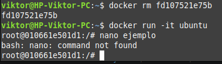

Al borrar el contenedor y volver a instalar uno con la misma imagen, observamos que, no tiene el nano instalado

---

### Paso 4

Para poder crear un contenedor nginx lo unico que tenemos que hacer unos sencillos pasos, lo primero es descargarse la imagen:

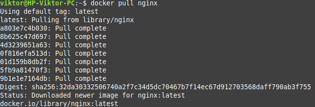

Despues encender el contenedor pero indicandole que por el puerto 8080 se ponga a escuchar:

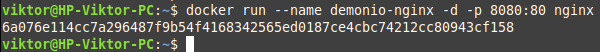

Y si ahora escribimos **http://localhost:8080/** podremos observar lo siguiente:

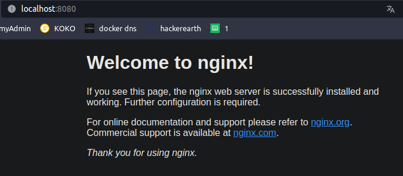

---

### Paso 5

Para crear la imagen de nextcloud tenemos que hacer lo mismo de siempre:

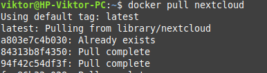

y ahora en la creacion del contenedor le indicaremos el nombre del sqlite al **docker run**:

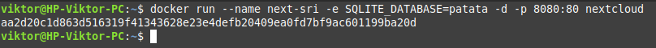