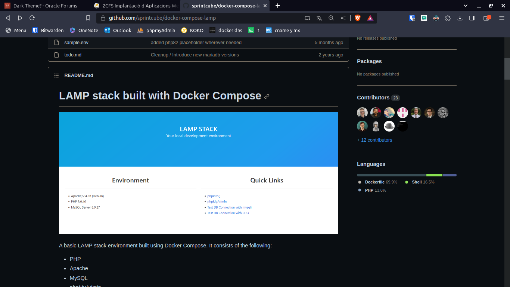
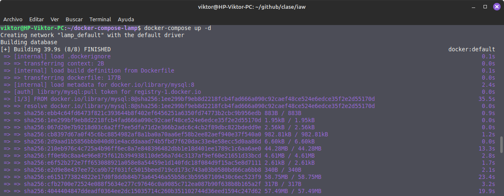
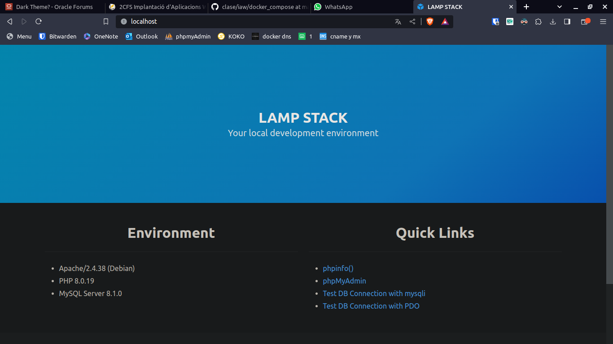

## Docker compose trabajo

**Victor Martinez**

---
### Paso 1 
Lo primero que tendremos que hacer es buscar un repositorio en github donde nos ofrezcan un docker-compose en el que nos instale una pila LAMP



### Paso 2
Despues haremos un git clone junto con la url del repositorio para descargarnoslo 

```bash
git clone https://github.com/sprintcube/docker-compose-lamp.git
cd docker-compose-lamp
```

### Paso 3
Una vez dentro del directorio del repositorio que nos acabamos de descargar, ejecutamos el siguiente comando:

```bash
docker-compose up -d
```

Y se empezara a descargar el docker con la pila LAMP:



### Paso 4
Una vez descargado (le tomara su tiempo) accedemos por el navegador mediante [localhost](http:localhost) y nos redigira a la siguiente pagina:



Y desde esta pagina podremos acceder tanto al phpinfo() para comprobar que esta el php instalado, el propio apache es la pagina que se muestra y el phpmyadmin para ver que tambien tiene acceso a un sqlserver