# Trabajo creacion de LAMP
## Victor Martinez

### Paso 1
Para crear un entorno LAMP es decir Linux, Apache, Mysql, Php, lo primero que vamos a requerir es de una maquina linux.

En esta guia ejecutaremos todos los comandos como root, para ello el primer comando que ejecutaremos será: **sudo su**

Una vez tengamos una maquina disponible vamos a actualizar la maquina con **apt update** y **apt upgrade**.

A continuacion instalaremos apache y activaremos el servicio:

```bash
apt install apache2
/etc/init.d/apache2 start
```
Una vez hecho eso si accedemos a nuestro [localhost](localhost) y nos aparecera la siguiente pagina:

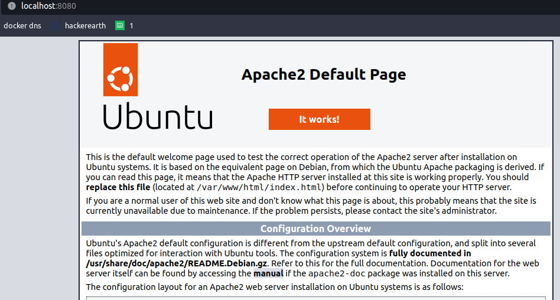

---

### Paso 2
El siguiente paso va a ser instalar Mysql server:

```bash
apt install mysql-server
/etc/init.d/myqsl start
```
Si todo ha funcionado bien al hacer **mysql -u root** deberiamos entrar dentro de **Mysql**

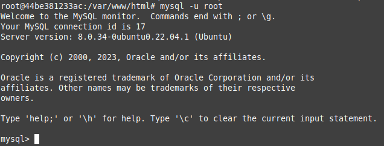

---

### Paso 3
Ahora vamos a crear un usuario y una base de datos que vamos a administrar mas adelante con **phpmyadmin**

Para crear el usuario con contraseña ejecutaremos la siguiente sentencia:

```mysql
CREATE USER 'USUARIO'@'localhost' IDENTIFIED BY 'CONTRASEÑA';
``` 
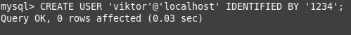


En caso de que no queramos indicarle una contraseña (cosa que desaconsejo encarecidamente) simplemente no escribiremos **IDENTIFIED BY 'CONTRASEÑA'**
y listo.

Ahora tendremos que darle permisos, en mi caso le dare todos los permisos:

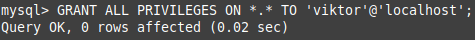

De manera mas recomendable podemos darle tambien solo ciertos permisos como son:


- SELECT
- INSERT
- DELETE
- UPDATE
- DROP
- GRANT OPTION
- CREATE

Recalcar que algunos permisos son mas peligrosos que otros y hay que pensar muy bien que permisos otorgar a los usuarios.

Despues de haber dado los permisos a los usuarios tendremos que hacer un **FLUSH PRIVILEGES** para aplicarlos:

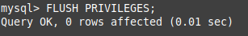

si quisieramos ver los usuarios que hay en el sistema bastaria con ejecutar esta sentencia:

```mysql
SELECT user,host FROM mysql.user;
```
Nos deberia salir algo parecido a esto:

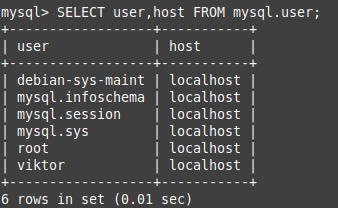

---

### Paso 4
Vamos a entrar con el usuario que hemos creado anteriormente y crearemos la base de datos:

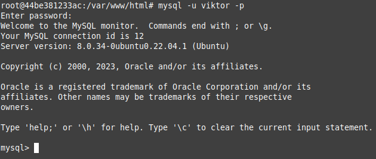

Si el usuario no tuviera contraseña, el parametro **-p** no haria falta ponerlo

Ahora, para crear una base de datos y empezar a crear tablas ejecutaremos:

```mysql
CREATE DATABASE <database>; 
USE <database>;
```
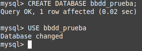

La sintaxys para crear unas tablas y unas columnas es :

```mysql
CREATE TABLE prueba1 (
    -> campo1 INT,
    -> campo2 varchar(10),
    -> campo3 DATE
    -> );
```

Y quedaria algo asi:

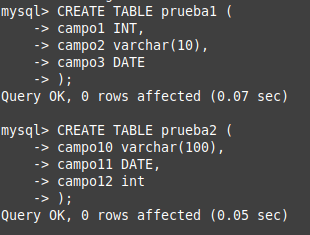

Si queremos ver las bases de datos que hay creadas por defecto en el sistema, para ello ejecutaremos esta sentencia:

```mysql
SHOW DATABASES; 
```

Despues de todo esto saldremos de mysql con **exit**

--- 

### Paso 5

Ahora toca instalar php para ello:

```bash
apt install php libapache2-mod-php php-mysql
```

Cuando haya acabado la instalacion crearemos un archivo de prueba que llamaremos **info.php**

Este sera su contenido:
```bash
<?php
    phpinfo();
?>
```
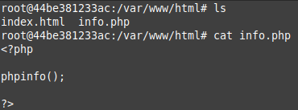

ahora si entramos a [localhost/info.php](localhost/info.php) veremos esta pagina:

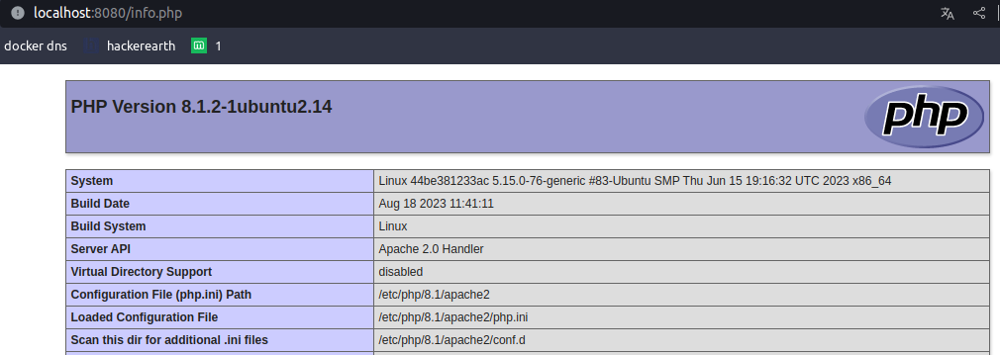

Si podemos ver esta pagina es porque todo ha ido correctamente.

---

### Paso 6
Una herramienta util para administrar las bases de datos es **phpmyadmin**, nos la instalaremos:

```bash
apt install phpmyadmin php-mbstring php-zip php-gd php-json php-curl
```
Durante la instalacion nos preguntara si queremos usar dbconfig-common para configurar la base de datos, le indicaremos que si.

Nos pedira tambien una contraseña, se la escribiremos, tambien nos dira que web server queremos usar, le indicamos que apache, una vez hecho esto esperaremos a que termine la instalacion.

Ahora si entramos en [localhost/phpmyadmin](localhost/phpmyadmin)

#### Posible error:
Si nos da un error de **Not Found** lo unico que tendremos que hacer es agregar esta linea al fichero **/etc/apache2/apache.conf** y reiniciar el servicio

```bash
Include /etc/phpmyadmin/apache.conf
/etc/init.d/apache2 restart
```
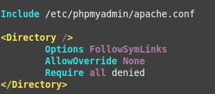

#### Posible error 2:

Si nos da error al logarnos tendremos que cambiar el fichero **/etc/phpmyadmin/config-db.php** la siguiente linea:

```bash
$dbserver='localhost';
--- por: ---
$dbserver='127.0.0.1';
```

Y ya te dejaria entrar:

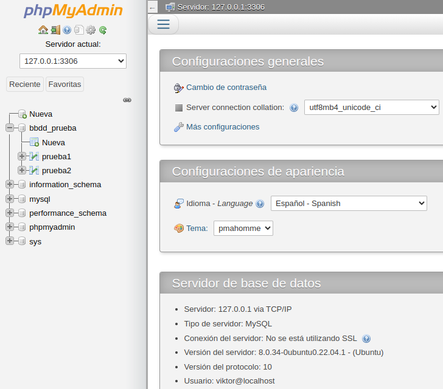

#### Usar phpMyAdmin para insertar datos:

Si quisieramos insertar cualquier dato en php MyAdmin es tan sencillo como pulsar sobre la base de datos, clicar sobre la tabla que queramos y en la columna que queramos insertar un registro:

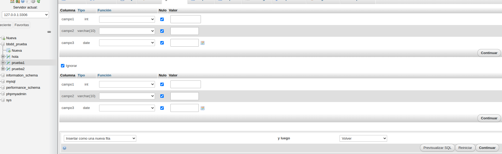

Y cuando hayamos insertado los datos le damos a **continuar**.


#### Mostrar la base de datos mediante un fichero .php:

En este [enlace](bbdd_prueba.php) esta el fichero ya corregido para poder mostrar mi base de datos.

##### Lineas cambiadas:
1. **$usuario** -> He cambiado el nombre de root por el que yo he creado

2. **$password** -> Le he añadido la contraseña del usuario
3. **$servidor** -> he cambiado localhost por 127.0.0.1 
4. **$basededatos** -> he cambiado alumnos por el nombre de la mia
5. En la linea de conexion he añadido la variable de **$password** y **$basededatos**
6. La consulta tambien la he cambiado para que coja los datos correspondientes
7. Los encabezados de las tablas los he cambiado para que coincidan con los nombres de las tablas
8. Los nombres de las tablas tambien lo he cambiado en las variables **$columna**

---

### Paso 7
Una alternativa de phpMyAdmin, vamos a descargarla y probar que funciona:

```bash
wget "http://www.adminer.org/latest.php" -O /var/www/html/adminer.php
```
Al acceder a [localhost/adminer.php](localhost/adminer.php) y nos logamos correctamente, accedemos como en el phpMyAdmin y vemos que funciona:

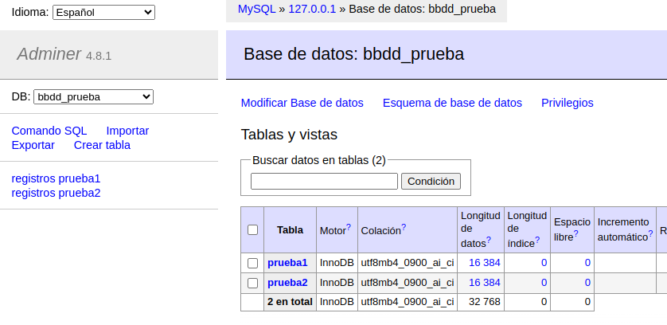

---

### Paso 8
Vamos a instalarnos GoAccess, un analizador de logs para Apache:

```bash
apt install goaccess
```

GoAcces tiene diferentes metodos de uso, pero vamos a usar el mas atractivo que es viendo el html para ello crearemos un archivo **HTML** en tiemp real y en segundo plano para que podamos seguir usando la terminal:

```bash
 goaccess /var/log/apache2/access.log -o /var/www/html/report.html --log-format=COMBINED --real-time-htmlm --daemonize
```

#### Posible error:
Si nos diera algun tipo de error o vieramos que la informacion que nos da es erronea puede ser porque GoAccess usa un puerto que por defecto no esta abierto, el puerto es 7890, para ello ejecutaremos el siguiente comando:

```bash
ufw allow 7890
```

El contenido de la pagina seria uno parecido a este:

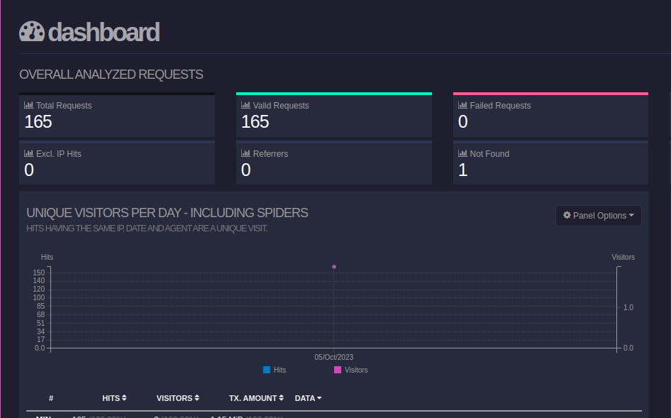