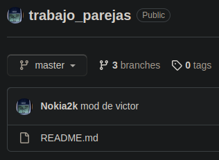
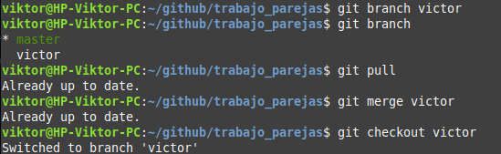
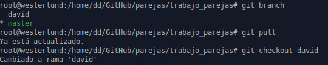
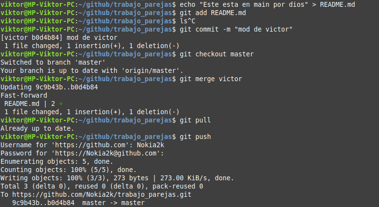
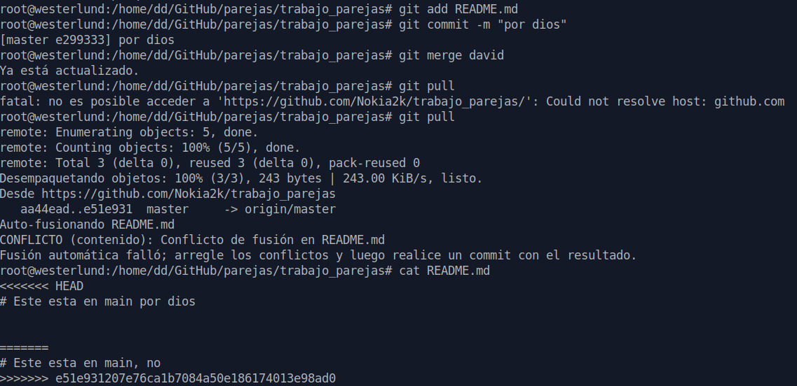
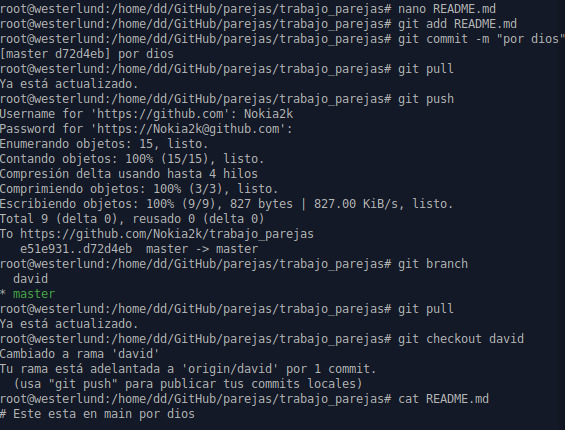
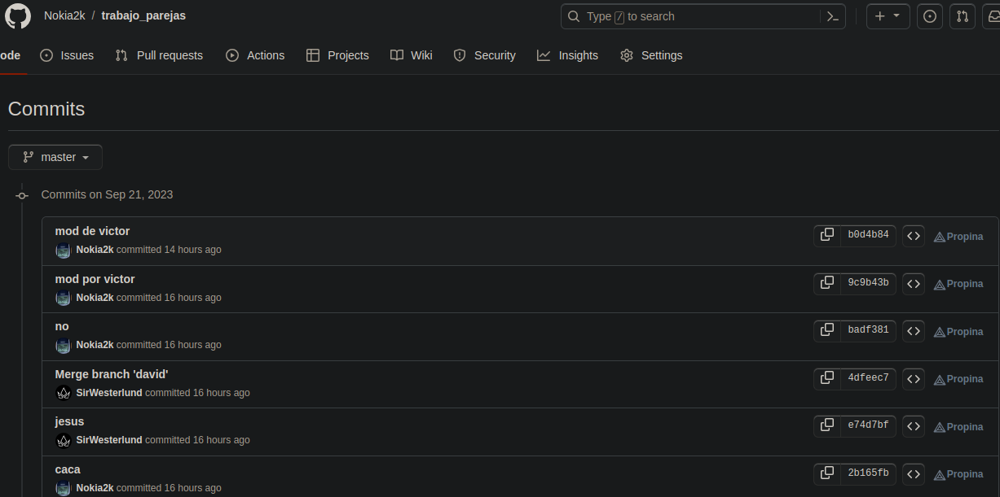

# Trabajo en parejas
<center>
    Integrantes:
</center>


| Nombre | Apellido | Equipo |
| -- | -- | -- |
| Victor | Martinez | HP-250 G6 Notebook PC |
| David | Tronchoni | MSI G70 2pe Apache Pro 

Para entrar al repositorio del que se va a hablar pincha [aqui](https://github.com/Nokia2k/trabajo_parejas).


Enlace para un markdown con todos los [alumnos](alumnos.md) 

## Paso 1
### - Creando el repositorio en GitHub
Creamos un repositorio en **GitHub** en nuestro caso con el nombre **trabajo_parejas**



### - Creando el repositorio en la maquina local
```bash
mkdir trabajo_parejas
cd trabajo_parejas
echo " # Trabajando en parejas" > README.md
```

## Paso 2
### - Crear ramas cada uno del equipo

Cada uno del equipo va a crear una version diferente del README.md.

Los *comandos* necesarios para hacer eso es `git pull` 

## Paso 3
### - Crear las ramas para que cada uno trabaje en su equipo

Los comandos para crear la rama en este caso con el nombre "primera" es:

```bash
git branch primera
git checkout primera
``` 

tambien podrias hacerlo directamente con 
**git checkout -b primera**



En el equipo de david seria igual:



## Paso 4
### - Modificar el archivo README.md cada uno para probocar conflictos

Primeramente yo voy a modificar el archivo *Readme.md* y subire los cambios yo primero para que a la hora de que david suba sus cambios tenga un problema de conflictos:



A continuacion vamos a ver que pasa en el equipo de david cuand vaya a subir los cambios que ha hecho sobre el mismo archivo:

(El contendio ahora es: *Este esta en main, no*)



## Paso 5
### - Resolver los conflictos

Una vez acordado cual es la version final con la que se va a quedar el archivo, en este caso **David** va a cambiar el contenido a como yo lo he modificado y observaremos que si que le dejara subir los cambios:



## Paso 6
### - Ver commits

Si en algun momento queremos ver los commits que se han ido haciendo a lo largo del trabajo aqui estan:



