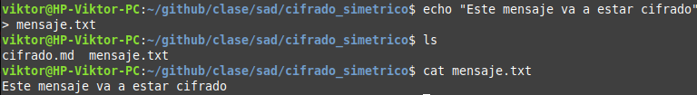
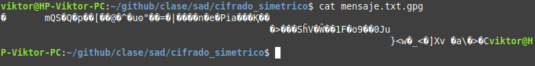
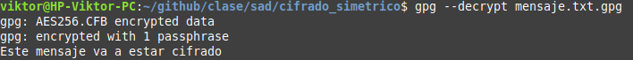
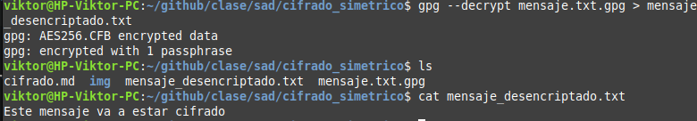

# Cifrado Simetrico
## Victor Martinez

### Paso 1
Vamos a crear un fichero con un contenido que vamos a cifrar despues:



---

### Paso 2
Ahora para encriptarlo con clave simetrica ejecutaremos el siguiente comando:

```bash
gpg --symmetric mensaje.txt
``` 
A continuacion nos pedira que le indiquemos una contraseña, una vez puesta la contraseña se creara un archivo con el mismo nombre pero con la extension .gpg

### Paso 3
Si vemos el contenido del fichero observamos que es un binario:



### Paso 4
Cuando vayamos a desencriptar el archivo si no le indicamos que redireccione el contenido de este unicamente nos lo indicara por la terminal:



### Paso 5
En caso de que queramos guardar el contenido en un fichero hay que hacer lo siguiente:
```bash
gpg --decrypt mensaje.txt.gpg > mensaje_desencriptado.txt
``` 
Ahora si ejecutamos el comando **cat** sobre este podremos ver el mensaje:



### Paso 6
Ahora prueba a descifrar tu el contenido del fichero con la contraseña: 1234 y mira el contenido del fichero.


