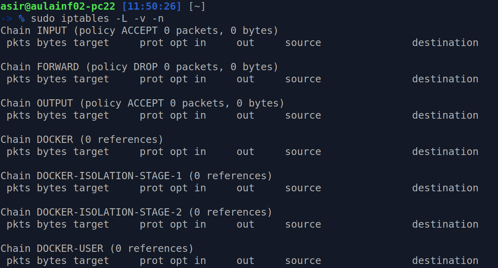
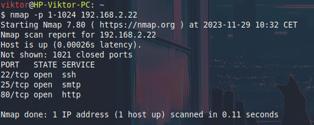
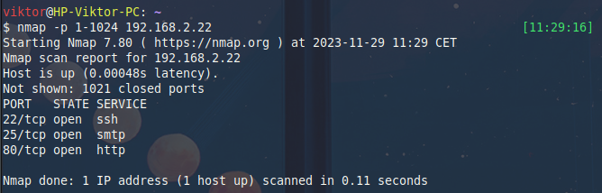
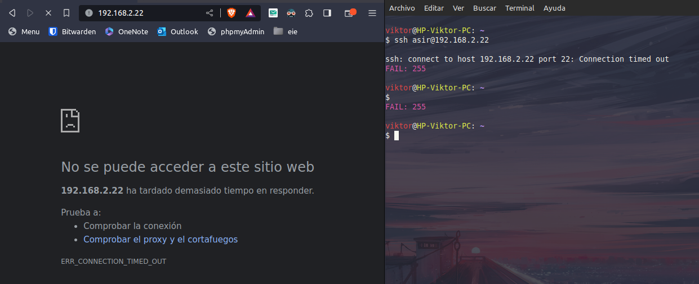
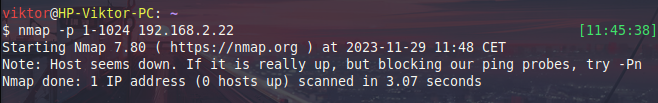
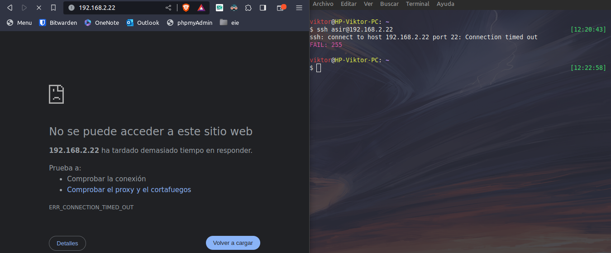
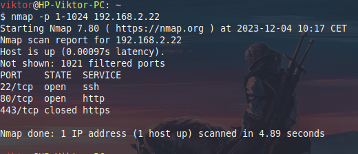
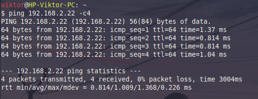
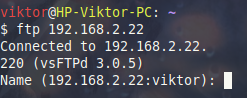
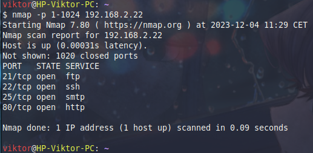

# UD-3 Instalacion y configuracion de cortafuedos y proxies
*Victor Martinez Martinez*

---

## Parte 1

**Limpia todas las reglas al Servidor y tendremos el firewall sin ninguna regla y parado.**
```bash
    iptables  -F
```

## Parte 2

**Mira el estado acutal de las reglas con** ```iptables -L -v -n```. 


## Parte 3

**En otro equipo virtual Ubuntu (será "Cliente") instala el software nmap. Nos servirá para hacer escaneo de puertos y comprobar si se puede acceder a los servicios del servidor de nuestro compañero y el nuestro**

Para comprbar los puertos que hay abiertos en la maquina donde hemos borrado todas las tablas bastara con usar el comando nmap con los sigiuentes paraemtros:

```bash
    nmap -p 1-1024 192.168.2.22
```

El resultado sera el siguiente:




## Parte 4

**Si las políticas por defecto del servidor no son ACCEPT en INPUT, OUTPUT y FORWARD, poned a todas ACCEPT**

Para poner todas las politicas por defecto en ACCEPT HAY QUE EJECUTAR LOS SIGUIENTES comandos:

```bash
    iptables -P INPUT ACCEPT
    iptables -P OUTPUT ACCEPT
    iptables -P FORWARD ACCEPT
```

## Parte 5

**Instala Apache y openssh-server en el Servidor.**

Para instalar los siguientes servicios basta con hacer el comando tipico de instalacion de linux:

```bash
    apt install ssh-server
    apt install ssh-client
    apt install apache2
```

## Parte 6

**Comprueba que puedes ver los servicios activos desde el Cliente, accediendo con un navegador web y un cliente ssh al servidor de nuestro compañero.**

Una vez instalado el ssh y el servidor apache comprobamos que podemos acceder a ellos mediante un buscador y por el propio ssh al equipo:


## Parte 7

**Comprueba también que nmap te muestra que los puertos de los servicios web y sshd están abiertos (escuchando).**

Si volvemos a ejecutar el comando nmap para ver los puertos que tiene abiertos observamos que tenemos los mismos puertos abiertos: **22**, **25** y el  **80**



## Parte 8

**Ahora cambia la configuración del firewall para cerrar el acceso al servidor. Pon en iptables que la política en INPUT, OUTPUT y FORWARD sea por defecto DROP. Comprueba el estado actual del firewall**

Si queremos bloquear todas las politicas del iptables bastara con cambiar los comandos que habiamos escrito antes de **ACCEPT** por **DROP**:

```bash
    iptables -P INPUT DROP
    iptables -P OUTPUT DROP
    iptables -P FORWARD DROP
```

## Parte 9

**Desde el cliente comprueba que los puertos de los servicios ya no son accesibles y tampoco se puede acceder con los clientes web y ssh. Comprueba que tampoco puedes acceder desde el servidor en la red, haciendo un ping al cliente.**

Si quisieramos entrar al apache o mediante ssh podremos observar que no podemos entrar al equipo de ninguna de las dos maneras



Y si observamos los puertos nos daremos cuenta que ya no son accesibles:



## Parte 10

**Permite el acceso a la máquina server solo desde la dirección IP de la máquina cliente del compañero a cualquier protocolo (recuerda, hay que activar la petición y la respuesta).**

```bash
    iptables -A INPUT -s  192.168.2.22 -j ACCEPT
    iptables -A OUTPUT -d 192.168.2.22 -j ACCEPT
    iptables -A INPUT -m state --state ESTABLISHED,RELATED -j ACCEPT
    iptables -A OUTPUT -m state --state ESTABLISHED,RELATED -j ACCEPT
```

Si comprobasemos en el equipo cliente el ssh o el apcahe podemos observar que si que funciona mientras que si probamos otro equipo que no tiene esa misma ip no podremos acceder a ninguno de los puertos

## Parte 11

**Comprueba que no se puede acceder por ejemplo desde nuestro cliente (ping, cliente web) a nuestro propio servidor, y un scan con nmap te dará todos los puertos cerrados. En cambio desde el cliente del compañero se tiene que poder.**

Si comprobamos lo que se pide podemos observar que el equipo cliente no funciona:



## Parte 12

**Permite el acceso a la máquina servidor solo a los puertos de los servicios Web (80, 443) y SSH (22), desde cualquier equipo, y prueba que ahora desde el cliente del compañero puedes acceder a los servicios web y ssh, pero que no puedes hacer un ping, por ejemplo. Comprueba también con nmap**

Para por seguridad vamos a hacer un Flush de todas las politicas y bloquearemos tambien todas las reglas:

```bash
    iptables -F
    iptables -P INPUT DROP
    iptables -P OUTPUT DROP
    iptables -P FORWARD DROP
```

Y depsues añadiremos las reglas para que accepte los puertos **80**, **443** y **22**:

```bash
    iptables -A INPUT -p tcp --dport 80 -j ACCEPT
    iptables -A INPUT -p tcp --dport 443 -j ACCEPT
    iptables -A INPUT -p tcp --dport 22 -j ACCEPT
    iptables -A INPUT -m state --state ESTABLISHED,RELATED -j ACCEPT
    iptables -A OUTPUT -m state --state ESTABLISHED,RELATED -j ACCEPT
```

Si quisieramos comprobar que el apache tambien funciona por el puerto **443** tendriamos que configurarlo para que trabaje tambien en ese puerto



## Parte 13

**Prueba a poner solo la regla de la cadena INPUT. ¿Funciona el servicio web? ¿Por qué?**

```bash
    iptables -A OUTPUT -m state --state ESTABLISHED,RELATED -j DROP
```
Y cuando vamos a comprbar podemos ver que si conectamos hacia el servidor si que podemos conectarnos a el pero el servidor no puede ver nada hacia fuera

## Parte 14

**Permite hacer ping a la máquina servidor (busca los icmp-type del ping), desde el cliente del compañero, y prueba que ahora desde el tuyo si puedes hacer ping.**

```bash
    iptables -A INPUT -p icmp --icmp-type echo-request -j ACCEPT
    iptables -A OUTPUT -p icmp --icmp-type echo-request -j ACCEPT
```
De esta manera podemos habilitar la opcion de hacer ping a la maquina cliente y la cliente hacia el servidor



## Parte 15

**Si queremos denegar que se pueda hacer un ping, ¿tendremos que hacer dos reglas INPUT y OUTPUT o solo con INPUT ya denegamos? ¿Por qué?**

Para denegar con que una de las dos reglas este en modo **DROP** el comando ping no sera capaz de comunicarse con las dos maquinas

## Parte 16

**Activa ahora el sercvicio FTP del servidor y limita el acceso al servidor FTP al cliente de tu compañero**

Primero limpiaremos otra vez las tablas para que no cree ningun tipo de conflicto, unicamente por si acaso y las pondremos todas por defecto.

```bash
    iptables -F
    iptables -P INPUT ACCEPT
    iptables -P OUTPUT ACCEPT
    iptables -P FORWARD ACCEPT
    
```

A continuacion instalaremos el paquete **vsftpd**:

```bash
    apt install vsftpd
```

Y ahora haremos las reglas necesarias en el cliente:

```bash
    iptables -A INPUT -p tcp --dport 20 -s 192.168.2.150 -j ACCEPT
    iptables -A OUTPUT -p tcp --sport 20 -s 192.168.2.150 -j ACCEPT
    iptables -A INPUT -p tcp --dport 21 -s 192.168.2.150 -j ACCEPT
    iptables -A OUTPUT -p tcp --sport 21 -s 192.168.2.150 -j ACCEPT
```
Para el modo pasivo hay que insertar las siguientes reglas tambien
```bash
    iptables -A INPUT -p tcp --sport 1024:65535 -m state --state ESTABLISHED,RELATED -j ACCEPT
    iptables -A OUTPUT -p tcp --sport 1024:65535 -m state --state NEW,RELATED -j ACCEPT
    iptables -A INPUT -m state --state ESTABLISHED,RELATED -j ACCEPT
    iptables -A OUTPUT -m state --state ESTABLISHED,RELATED -j ACCEPT
```


## Parte 17

**Comprueba desde tu cliente que no se puede acceder a FTP pero desde el cliente del compañero sí. Mira con nmap desde los dos equipos cliente (el tuyo y el del compañero).**

Para observar que desde mi cliente si funciona bastaria con intentar conectarse al servidor y hacer un nmap:

**conectarse al servidor:**




**Escano por nmap:**




## Parte 18

**Haz que la configuración de iptables sea persistente al servidor. Comprueba reiniciando el servidor. Comprueba que las reglas iptables continúan existiendo.**

Hay varias opciones para que as iptables sean persistentes, una de ellas es crear un script con las normas que quieras que se establezcan al inicio del equipo, despues ejecuta estos comandos: 

Primero ejecuta este comando:
```bash
runlevel 
```
Y despues crea un enlace simbolico hacia este directorio, de esta manera ya las normas seran persistentes al inicio de la maquina:

```bash
ln -s TU/RUTA/HACIA/EL/SCRIPT/tablas.sh /etc/rc?.d
```

Cambia el interrogante por el numero que te ha salido del comando anterior
