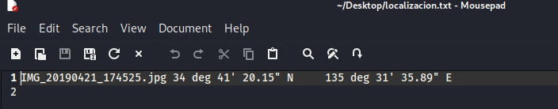
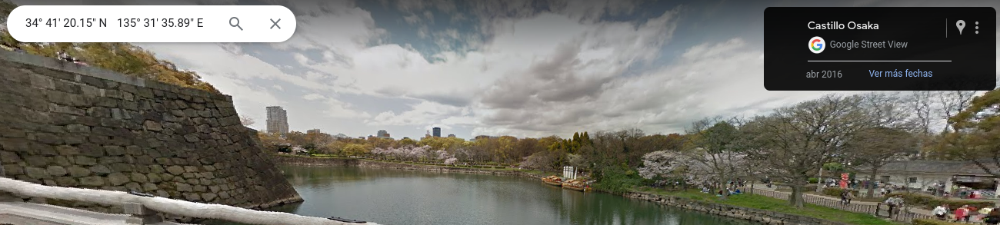

# Geolocalizacion
### Trabajo kali para conseguir la ubicaion de una imagen 
### Victor Martinez

---

#### Paso 1

Vamos a conocer la localizacion de una imagen mediante un simple comando de kali.
Lo primero que necesitamos es una foto que haya tomado la victima, por ejemplo de sus vacaciones:


#### Paso 2

Ahora, en kali, vamos a ejecutar el siguiente comando:

```bash
exiftool -filename NOMBRE_DE_LA_IMAGEN -gpslatitude -gpslongitude -T > NOMBRE_ARCHIVO.txt
```


Parametros a conocer:
- -filename: Es el nombre de la imagen para conocer sus datos

- -gpslatitude: nos indica su latitud
- -gpslongitude: nos indica su longitud
- -T: nos lo muestra en modo tabla

#### Paso 3

Si observamos el contenido del arhcivo por el cual le hemos indicado al comando que nos diga los datos podemos observar lo siguiente:



Aqui lo unico que tendriamos que hacer es cambiar las letras **deg** por el simbolo **º**

#### Paso 4

Si ahora buscamos la ubicacion, por ejemplo, en google maps podemos observar que es la misma ubicacion donde se ha tomado la foto:



